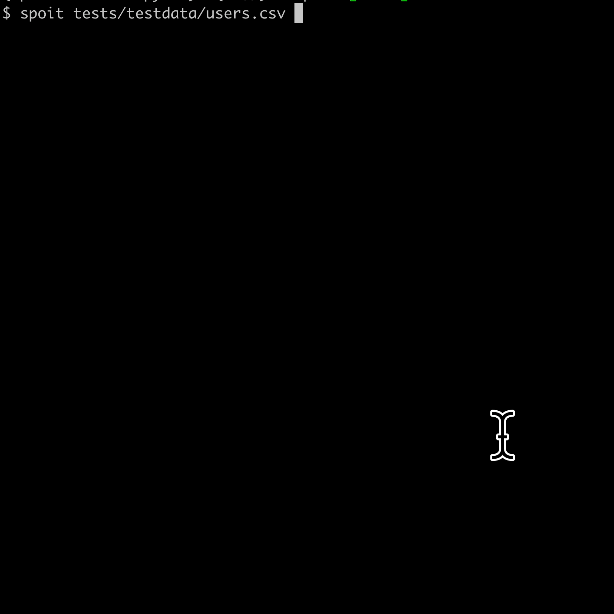

# spoit
Interactively extract columns from the CSV and copy the snippets to your clipboard.

The purpose is to ease the preprocessing of large CSV (especially those with many unnecessary columns).

## Demo
### default

### `--omit` option

### `-a` option: Copy all unused cols as comment
If there are many columns, it is easier to adjust them in the editor than to select them one by one.

